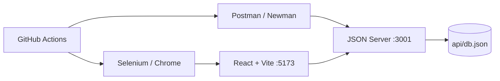

# Hotel Booking · API & UI Test Automation

[](https://github.com/esinbegumkaya/HotelBooking-TestAutomation/actions/workflows/ci.yml)
   

A deliberately automation-friendly hotel booking demo with a React/Vite UI, JSON Server REST API, Postman collection, and Selenium browser suite. Originally an academic Test Automation Term Project; expanded with repeatable local execution, explicit assertions, failure screenshots, a reporting runner, and GitHub Actions CI.

> CI badge becomes active after the upgraded repository is pushed to GitHub and the workflow runs. These changes have not been deployed automatically to Render.

## Observed local execution (2026-09-26)

| Metric | Observed outcome |
| --- | ---: |
| Newman API requests | **14/14 executed** |
| Postman assertions | **70/70 passed** |
| Selenium browser scenarios | **11/11 passed** |
| Failures in this local run | **0** |

These figures come from the user-provided Windows PowerShell run and generated Selenium HTML report; they are **not** a CI result, coverage percentage, or a statement about production reliability. The full per-test timings and API CRUD verification are documented in [local execution evidence](docs/test-evidence/LOCAL_TEST_RUN_2026-09-26.md). Generated machine-readable reports are available after running the suite.

**CI status:** GitHub Actions workflow is configured, but its success must be checked on the repository's Actions tab after the updated code is pushed. The badge above reflects GitHub's live result only once this version is uploaded.

## What is tested?

| Layer | Tools | Coverage |
| --- | --- | --- |
| API | Postman + Newman | HTTP methods and response checks, positive, negative and mock-backend edge cases |
| UI | Selenium WebDriver (Chrome) | Booking journey, date and email validation, back/refresh, mobile viewport and API failure |
| Integration | Selenium + REST fetch | Booking created through browser, verified via API and deleted during cleanup |
| CI | GitHub Actions | Build, fixture checks, Newman and headless browser suite against local services |

## Architecture



## Getting started

Requirements: **Node.js 20+**, npm, Chrome/Chromium. For ZIP downloads, extract the ZIP and open a terminal in the root folder containing `package.json`.

```bash
npm install
npm ci --prefix api
npm ci --prefix ui
npm ci --prefix selenium
```

Set the local frontend API URL (copy `ui/.env.example` to `ui/.env` if the latter does not exist):

```env
VITE_API_URL=http://localhost:3001
```

Start both servers together:

```bash
npm run dev
```

Open http://localhost:5173. The REST API runs at http://localhost:3001 and exposes `/hotels` and `/bookings`. Keep this terminal open while running tests in a **second terminal**.

### Test commands

```bash
npm run test:unit         # Fixture and collection structural checks
npm run test:api          # Postman collection via Newman; local API by default
npm run test:ui           # All numbered Selenium tests, with report generation
npm run test:all          # Newman followed by Selenium
npm run test:performance  # 20 sequential LOCAL API smoke requests only
```

PowerShell environment override example:

```powershell
$env:BASE_URL="http://localhost:5173"
$env:API_URL="http://localhost:3001"
npm run test:ui
```

To run tests against another environment, change the variables explicitly. **Do not run write/delete integration cases against a shared public deployment**: they create and delete bookings. For the headed browser, set `HEADLESS=0` (PowerShell: `$env:HEADLESS="0"`).

### Test artifacts

The Selenium runner writes `selenium/artifacts/report.html`, `results.json`, and `junit.xml`. On failure it also saves a screenshot under `selenium/artifacts/screenshots/`. Newman exports `artifacts/postman-junit.xml`. CI uploads available reports and screenshots as workflow artifacts. These generated files are gitignored.

## Scenario matrix

| ID | Type | Expected outcome |
| --- | --- | --- |
| 01 | Positive | Booking succeeds; reservation ID returned; test booking removed |
| 02 | Negative | Reversed dates show a validation error |
| 03 | Boundary | Same-day dates are rejected by the UI (mock API may accept them) |
| 04 | State | Back navigation returns to the search page with reset inputs |
| 05 | State | Refresh on results loads hotels again |
| 06 | Negative | Empty guest fields show validation feedback |
| 07 | Negative | Invalid email shows validation feedback |
| 08 | Integration | UI booking is verified by GET `/bookings/{id}` and deleted |
| 09 | Integration | Two successive bookings receive distinct IDs and are deleted |
| 10 | Responsive | Hotel search remains accessible at mobile viewport width |
| 11 | Resilience | A blocked hotel API request displays a user-facing error |

The Postman collection has separate positive, negative, edge, and supplementary endpoint groups. Review [`docs/TEST_STRATEGY.md`](docs/TEST_STRATEGY.md) and [`docs/TEST_CASES.md`](docs/TEST_CASES.md) for assumptions and traceability.

## REST endpoints

| Method | Resource |
| --- | --- |
| GET | `/hotels` |
| GET / POST | `/bookings` |
| GET / PUT / DELETE | `/bookings/{id}` |

`json-server` is intentionally a **mock**, not a production booking backend. It does not enforce all business rules. The UI rejects same-day/reversed dates, whereas direct API requests can demonstrate permissive edge behavior. Test data in the mock database may be changed by API tests; CI uses its own disposable checkout.

## Postman

- Import `postman/Booking API Test Collection.postman_collection.json`.
- Import `postman/HotelBooking.postman_environment.json`.
- Set `baseUrl` to `http://localhost:3001` for local runs, or use the root `npm run test:api` script to override it automatically for Newman.
- Collection and environment are stored as exportable JSON; credentials are not required.

## Deployment

Previously published demo endpoints:

- [UI on Render](https://hotel-booking-ui-czp6.onrender.com)
- [API on Render](https://hotel-booking-api-29et.onrender.com)

`render.yaml` contains the two-service configuration. A new release requires pushing the changes and deploying them; this ZIP itself does not update existing hosted services. Local tests are the default to avoid modifying shared demo data.

## Project layout

```text
api/                 Mock API, initial JSON fixture
ui/                  React pages and Vite configuration
postman/             API collection and environment export
selenium/tests/      Numbered browser scenarios and shared helpers
selenium/run-tests.js Suite runner, JUnit/HTML/JSON reporting
scripts/             Newman integration and local performance smoke
.github/workflows/ci.yml  Automated checks
docs/                Test strategy, case matrix and dated execution evidence
```

## Quality notes and limitations

- Failure screenshots are captured automatically, but they are not a substitute for diagnosing server logs.
- Selenium tests use the browser installed on the executing machine; CI uses its hosted Chrome installation.
- The performance smoke performs only **20 sequential local requests**, not a load/capacity benchmark.
- Existing transitive dependency audit findings should be reviewed separately; forcing major-version upgrades without verification is not advised.
- UI screenshots/GIFs should be captured from a running instance before adding them as evidence; no fabricated execution results are included.
- No authentication, payments, or production-grade persistence is implemented.

## Author

**Esin Begüm Kaya** · B.Sc. Computer Engineering · Minor in Management Engineering

[GitHub](https://github.com/esinbegumkaya)
